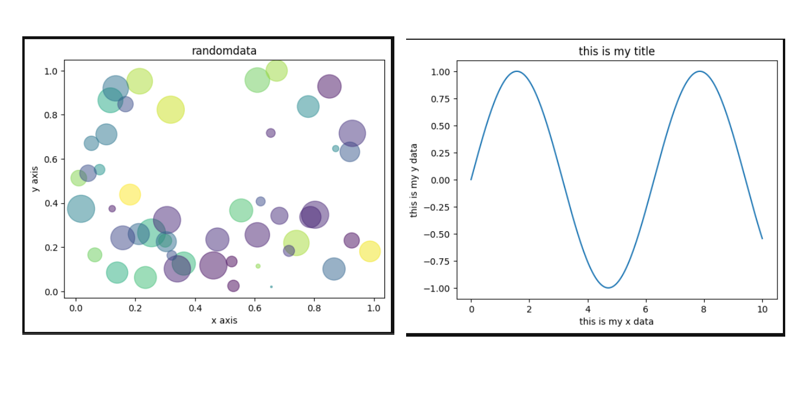

# MAT-PLOT-LIB-Storytelling-with-Data-
Matplotlib is a Python tool that visually represents data using various charts and graphs.
📊 Matplotlib Data Visualization
🐍 About

Matplotlib is a powerful Python library used for creating data visualizations such as line charts, bar graphs, scatter plots, pie charts, and histograms.
It helps transform raw data into meaningful visual insights.

  

📈 Features

Easy to create 2D and 3D visualizations

Highly customizable styling

Works seamlessly with NumPy and Pandas

Used for data analysis, reports, and dashboards

💡 Examples of Charts

Line Chart

Bar Chart

Pie Chart

Scatter Plot

Histogram
